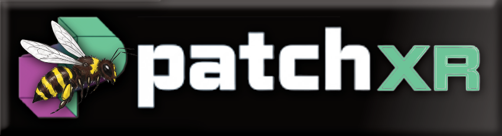

  

🐝🐝🐝 THIS IS AN ALPHA BUILD YOU WILL EXPERIENCE BUGS 🐝🐝🐝

 -Update 2-

## Quick start

1. **Run the app** — On first launch you’ll see a layout wizard (Minimal / Full / Performance). Pick one; you can change it later via Menu → Layout.
2. **Connect OSC** — Open Config (gear), enter your Patchworld/headset IP and ports (e.g. out 5550, in 3330), then click Connect. Status bar shows “OSC connected” when ready.
3. **MIDI** — Select your MIDI input (e.g. Virtual Keyboard or hardware) and output in Config. Use the main Sequencer module for step sequencing and the Editor for piano roll.
4. **Transport** — Play/Stop, tempo, and Oct +/- are in the transport bar. Use Menu → Keyboard shortcuts to see hotkeys.

## Rendering & performance (all platforms)

- **Software** — No GPU required; works on every system. Use this if you have no dedicated GPU or drivers are problematic.
- **OpenGL (Eco / Pro)** — GPU-accelerated rendering. Eco ≈ 30 FPS, Pro ≈ 60+ FPS. Supported on **Windows, Linux, and macOS**.
- **Vulkan** — Optional build with **Vulkan SDK** and `-DPATCHWORLD_VULKAN_SUPPORT=ON`. On **Windows**, the Vulkan backend uses the loader and Win32 surface; when selected in Config (GPU backend = Vulkan), the main window is rendered via Vulkan (clear-only for now; full UI overlay later). On **Linux/macOS**, Vulkan surface creation is stubbed (use OpenGL). Detection at runtime shows Vulkan in Config when the loader is present.
- **Metal** — Native on **macOS**; detected for future use. The app currently uses OpenGL on Mac for compatibility.
- **macOS / Apple Silicon (ARM)** — Builds natively for arm64. Threading (Adaptive) reserves cores for audio/UI and caps worker threads on ARM for good P-core/E-core balance. Optional link-time MoltenVK: set `PATCHWORLD_LINK_MOLTENVK=ON` and have Vulkan SDK or `molten-vk` in a standard path.
- **Threading** (Config → Worker Threads): **Single** (one thread), **Multi-core** (fixed workers), **Adaptive** (auto-detect). Affects background work (e.g. OSC, processing); audio and UI remain responsive.

If the GPU context is lost (e.g. sleep/wake, driver reset), the app switches to Software and shows a status message. You can switch back to Eco/Pro in Config after reconnecting. **Vulkan**: device lost is handled the same way (switch to Software); swapchain is recreated automatically on resize or when the driver returns out-of-date.

🔗 Getting Connected 🔗

📡 Find Your Headset IPv4 Adress🐝

In your headset, open Settings.

⚙️ Network → Wi-Fi and select your current connected wifi network → Scoll to find IPv4 ⚙️

(Addresses will look something like , 192.168.x.x or 10.0.x.x or even 172.16.x.x).

🕹️ Setup in Patchworld:

PC → Patch	Spawn Execute block and set: port_in 3330. Hit Connect in the bridge app.
Patch → PC	Spawn Execute block and set: port_out 5550. Hit Connect in the bridge app.

🎹 Devices are already made in Patchworld that have these blocks, OSC addresses mapped already so check out Beesplease's/BeeTeam's Worlds)

💎 Pro Patch Tip: Connect an Onload block to your Execute blocks to automatically set execute blocks which will trigger port(s) and IP when the world loads. 💎

🛠️ Troubleshooting Connectivity:

PC → Patch fails: Manually enter the Headset's IPv4 in the bridge app and reconnect. 

❌ No Luck? Try spawning an Execute block In Patch and set: remote_ip <PC_IPv4_HERE>

If Patch → PC fails: Ensure Execute block in Patch is set to your PC's IPv4 address.

🎹 OSC Addresses (X = MIDI channel 1-16):

🐝 OUTGOING TO PATCH:

/chXnote (Note On) 
/chXnvalue (Note Velocity) <Might change to /chXnote with multiple arguments if issues are resolved>
/chXnoteoff (Note Off)
/chXcc (CC#) <Knob/Slider>
/chXccvalue (CC Value) <Knob/Slider position>
/chXpitch (Pitch Wheel) 
/chXpressure (Aftertouch)

🐝 RECIEVING FROM PATCH:

/chXn (Note On) 
/chXnv (Note Velocity)
/chXnoff (Note Off)
/chXc (CC#) <Knob/Slider>
/chXcv (CC Value) <Knob/Slider position>
/chXwheel (Pitch Wheel) 
/chXpress (Aftertouch)

💻 Bridge Gui Controls:

/play (Bridge playback starts/stops) <Toggle value 1)
/stop
/rewind
/loop
/tap
/octup
/octdown

💡 Resources & Info:

🎹 This project is built using CMake, uses the JUCE 8 Framework and Ableton Link Repos. More features/fixes are coming soon! JUCE Website - https://juce.com/ - https://github.com/juce-framework/JUCE - | Ableton Link - https://github.com/Ableton/link | CMake - https://cmake.org/ -
